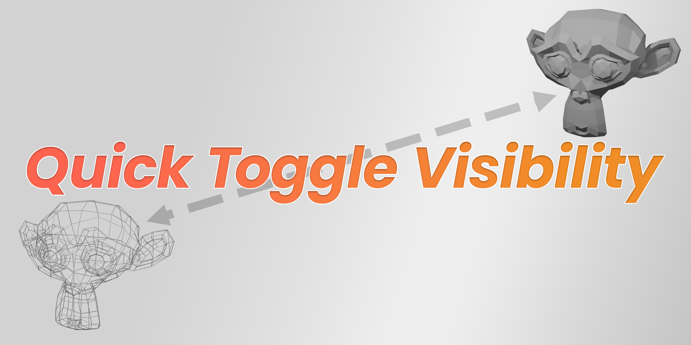
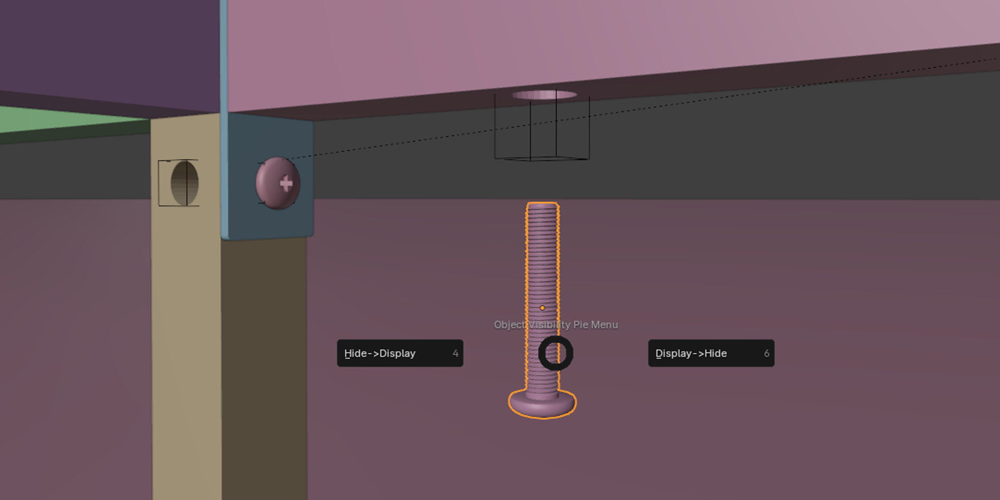
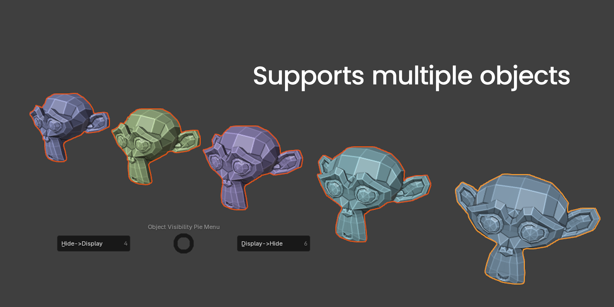
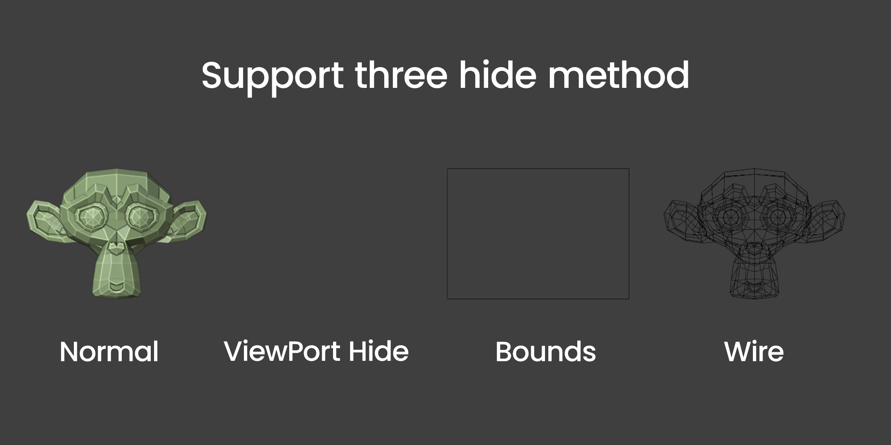

In the intricate world of 3D modeling, particularly within the context of creating installation tutorials, managing the visibility of numerous components can become a daunting task. This is where the Quick Toggle Visibility plugin for Blender truly shines. It offers a suite of features tailored to enhance productivity and streamline the workflow, especially when dealing with complex scenes involving a multitude of parts.

One of the standout features of this plugin is its ability to handle multiple objects at once, a godsend for those working on tutorials where each component must be meticulously managed for visibility. This batch operation capability allows for uniform changes across selected objects, ensuring that keyframing for visibility is both swift and consistent.

The plugin also supports various hide modes, including wireframe, boundbox, and viewport hidden, providing flexibility in how objects are managed within the scene. This feature is particularly useful when fine-tuning the final render, as it allows artists to focus on specific elements without visual distractions from other parts of the model.

For those who prefer a personalized workflow, Quick Toggle Visibility allows for the customization of shortcuts. This feature empowers users to tailor the plugin's functions to their preferred keyboard shortcuts, further accelerating the modeling process.

But the plugin's utility extends beyond day-to-day modeling tasks. In the context of creating 3D installation tutorials, where objects need to be shown or hidden at specific intervals, the need for efficient visibility management becomes paramount. Quick Toggle Visibility simplifies this process by offering a pie menu interface that enables users to set keyframes for visibility with ease. This not only saves time but also reduces the potential for errors, ensuring that each object's visibility is perfectly timed for the tutorial.
In conclusion, the Quick Toggle Visibility plugin is more than just a tool—it's a productivity booster designed for 3D artists who demand precision and efficiency in their work. Whether you're building a complex model or creating a step-by-step tutorial, this plugin is a valuable addition to your Blender toolkit, ensuring that your focus remains on creativity rather than menial tasks.
